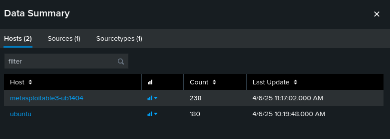
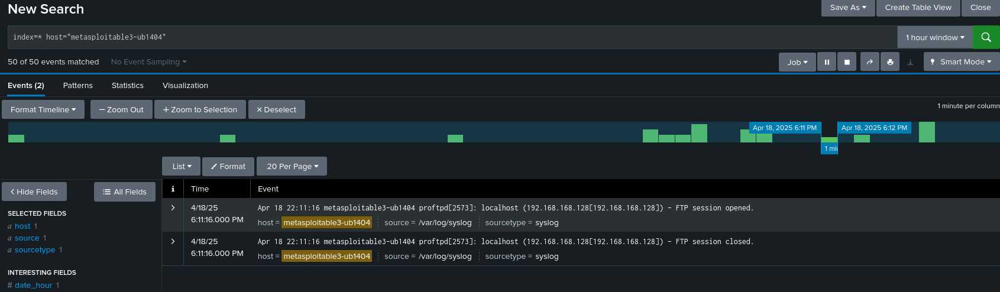
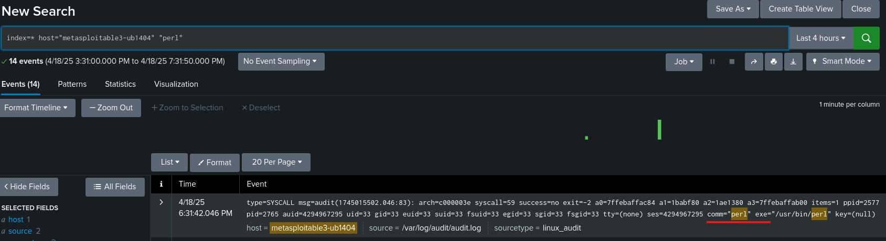
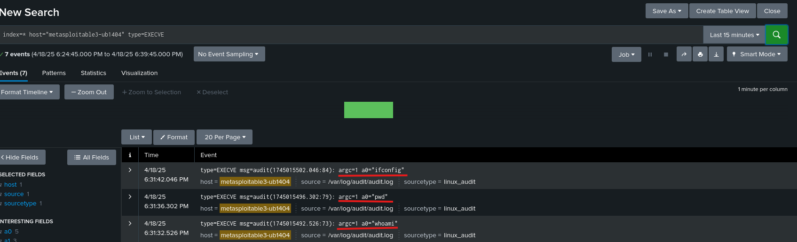
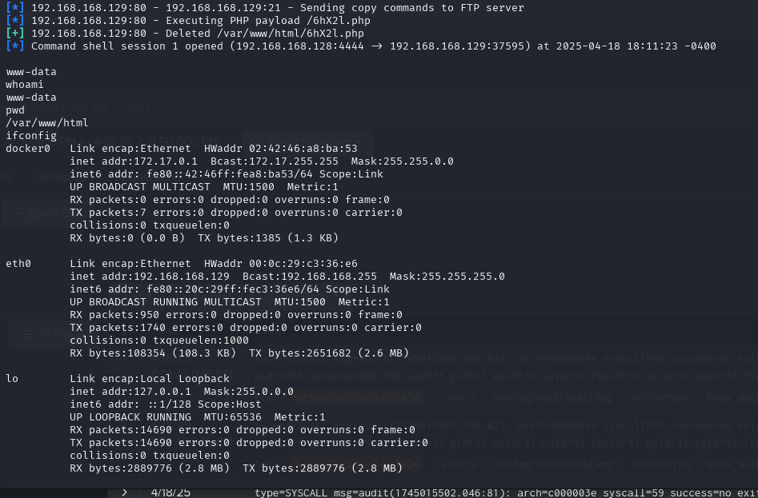

# Phase 2: SIEM Dashboard Analysis

This phase focuses on integrating and visualizing logs from the victim environment using Splunk, and comparing those logs with the actions performed by the attacker. The goal is to understand the attack patterns and behaviors observed during Phase 1 and compare logs from the compromised victim with those from the attacker.

---

##  Step 1: Environment Overview

- **SIEM Tool:** Splunk Enterprise (v9.3.2)
- **SIEM Location:** Kali Linux VM (Attacker)
- **Log Source:** Metasploitable3 VM (Victim)
- **Splunk Forwarder Installed:** Yes (on Metasploitable3)
- **Connection Type:** Host-Only Network
- **Monitored Log File:** `/var/log/syslog` and `/var/log/audit/audit.log`

> 📎 **Note:** For Splunk installation steps, see [splunk_installation.md](./splunk_installation.md)

---

##  Step 2: Splunk Setup & Configuration

### 🔹 Splunk Server Setup (Kali Linux)

Splunk Enterprise was installed on the Kali Linux attacker VM using the `.deb` package. After installation, it was accessed via the web browser:

```bash
http://localhost:8000
```


The Splunk web interface was used for log visualization and analysis.

---

### 🔹 Splunk Forwarder Setup (Metasploitable3)

The Splunk Universal Forwarder was installed on Metasploitable3. After installation, it was configured to forward logs to the Splunk Server using the following commands:

```bash
sudo /opt/splunkforwarder/bin/splunk add forward-server <splunk-server-ip>:9997
sudo /opt/splunkforwarder/bin/splunk add monitor /var/log/syslog
sudo /opt/splunkforwarder/bin/splunk add monitor /var/log/audit/audit.log
```


📘 **Why monitor `/var/log/syslog`?**

`/var/log/syslog` is the main log file in many Debian-based systems (like Metasploitable3) and contains general system activity, including:

- **FTP service logs** (like session opens/closes)  
- **Background cron jobs**  
- **Kernel events**  
- **Network interface updates**  
- **Shell session data** (including commands run via `sudo`, potentially from reverse shells)  

This makes it highly suitable for:  
✔ Monitoring post-exploitation activity  
✔ Tracking attacks at the system level  

📘 **Why also monitor `/var/log/audit/audit.log`?**

`/var/log/audit/audit.log` tracks all system-level audit events, including commands executed via reverse shells (e.g., `whoami`, `pwd`, `ifconfig`). While `/var/log/syslog` helps detect FTP sessions or cron jobs, it does not reliably capture the attacker's commands.

Enabling `EXECVE` syscall tracking through `auditctl` allowed us to:

- Capture attacker commands after reverse shell
- Detect system enumeration (`ifconfig`, `whoami`, etc.)
- Provide stronger forensic proof of compromise

##  Step 3: Verifying Log Ingestion

Once configuration was complete, the Metasploitable3 host appeared in the **Splunk > Search & Reporting > Data Summary** panel.

Splunk confirmed it was successfully receiving data from Metasploitable3 about these logs: `/var/log/syslog` and `/var/log/audit/audit.log`.

A screenshot of the connected host appeared like this:



In the screenshot above, two hosts are listed:

- metasploitable3-ub1404 – the victim machine (correctly configured with the Splunk Universal Forwarder).

- ubuntu – the machine running Splunk (Kali attacker VM), automatically recognized as a host.

This is expected behavior. Splunk often logs internal activity from the system it’s installed on (in this case, Kali Linux), even if you haven’t explicitly configured forwarding. It uses the system hostname (ubuntu) by default.

---

## Step 4: Basic Log Queries

Initial log searches were performed in Splunk's **Search & Reporting** app using basic SPL (Search Processing Language) queries. The first query was broad, designed to ensure that log data from the victim machine was being received properly:

```bash
index=* host="metasploitable3-ub1404"
```


Once data ingestion was confirmed, more focused queries were used in the following sections to isolate specific attack activity, such reverse shell execution.

---

## Step 5: Log Analysis – FTP Exploitation and Reverse Shell Proof

To validate the FTP vulnerability exploitation (ProFTPD `mod_copy` module) from Phase 1 and prove the attacker’s reverse shell access, we examined logs captured in both `/var/log/syslog` and `/var/log/audit/audit.log`.

---

### 🔍 FTP Exploit Logs

To validate the FTP exploit, we located the relevant logs by reviewing the time of the attack and inspecting `/var/log/syslog` events around that window. This revealed FTP session activity from the attacker's IP address (`192.168.168.128`):



- A **session was opened**, logging the attacker's IP as the source.  
- The session **was closed seconds later**, which aligns with the `mod_copy` exploit behavior: the attacker uses FTP only to upload and trigger a malicious payload (e.g., a PHP script) and doesn’t maintain a persistent connection through it.


---

### Reverse Shell Execution Proof (Perl Interpreter)

After the attacker used the FTP service to upload a malicious file, that file created a **reverse shell** — a hidden connection from the victim back to the attacker.
This connection was made using a tool called `perl`, which is a scripting language that attackers often use to write small programs (like reverse shells).
In our case, the logs confirmed that a program was run using `/usr/bin/perl`, and from that session the attacker was able to execute system commands like `whoami` and `ifconfig`.

We used the following SPL search query to isolate Perl shell-related activity:

```bash
index=* host="metasploitable3-ub1404" "perl"
```


The logs confirmed the execution of `/usr/bin/perl` as the interpreter used to run attacker commands post-exploitation:



This confirms that:

- A **Perl shell** was launched on the victim.
- It was executed shortly after the FTP session, indicating successful payload delivery.
- Every subsequent attacker command (e.g., `whoami`, `pwd`, `ifconfig`) was issued from within this Perl session, as shown in additional audit logs.

---

### ✅ Summary

-  The FTP session was used to **inject the reverse shell payload**, but not for maintaining access.
-  The attacker gained a **reverse shell using Perl**, and command execution was captured using `auditd`.
-  This sequence provides strong proof of successful exploitation and post-access attacker activity.

Together, these logs form a complete picture of the **initial access and command execution phase** of the attack.


## Step 6: Forensic Proof of Attacker Commands

To validate post-exploitation activity and confirm attacker presence, we configured the system to monitor all command executions using Linux Audit. This approach provided granular insight into what the attacker did **after gaining reverse shell access**.

### 🔸 Enabling `execve` syscall monitoring

To capture every command executed on the victim machine, we enabled Linux auditing using this command:

```bash
sudo auditctl -a exit,always -F arch=b64 -S execve
sudo auditctl -a exit,always -F arch=b32 -S execve
```


This ensured that all executed commands (e.g., `whoami`, `pwd`, `ifconfig`) would be logged to `/var/log/audit/audit.log`.

---

### 🔸 Attacker Command Evidence in Splunk

After launching the **FTP exploit (`proftpd_modcopy_exec`)**, the attacker received a reverse shell and ran several basic system commands:

- `whoami` – to determine current user privileges  
- `pwd` – to identify current working directory  
- `ifconfig` – to view network interfaces and IP addresses  

These commands were successfully captured and forwarded to Splunk.

We used this SPL query to identify the exact EXECVE logs for the commands:

```bash
index=* source="/var/log/audit/audit.log" type=EXECVE 
```


---

### ✅ Screenshot Proof



In this screenshot, Splunk confirms the execution of the attacker-issued commands. Each row shows:

- The command captured as `a0="..."`  
- The `type=EXECVE` audit event from `/var/log/audit/audit.log`  
- The `host=metasploitable3-ub1404`, proving it originated from the victim VM  

---
### 🖼️ Attacker Activity Snapshot

To provide additional clarity, the screenshot below shows what was performed by the attacker on the Kali machine after the exploit:

- Payload was uploaded and triggered via FTP (`/6h2x1.php`)
- A reverse shell was opened from the victim to the attacker
- The attacker ran system enumeration commands: `whoami`, `pwd`, `ifconfig`



These same commands were successfully detected in Splunk via `/var/log/audit/audit.log` on the victim.

### 📌 Summary

This provides **concrete forensic proof** of attacker interaction with the system, enabling us to:

- Confirm reverse shell success  
- Trace the attacker’s behavior step-by-step  
- Enhance the credibility and completeness of the SIEM report

## Step 7: Attacker vs Victim Log Comparison

This phase required comparing logs from both the **attacker** and **victim** environments. In our setup:

- **Victim Machine (Metasploitable3)**:
  - Monitored logs: `/var/log/syslog`, `/var/log/audit/audit.log`
  - Logs collected via Splunk Universal Forwarder.
  - Captured detailed proof of:
    - FTP session open/close (attack entry point)
    - Reverse shell establishment (via Perl)
    - Command execution (`whoami`, `pwd`, `ifconfig`)

- **Attacker Machine (Kali Linux)**:
  - Actions performed:
    - Scanned the target using `nmap`
    - Selected and configured the Metasploit exploit: `exploit/unix/ftp/proftpd_modcopy_exec`
    - Delivered a reverse shell payload using Perl
    - Ran system commands through the shell (`whoami`, `pwd`, `ifconfig`)
  - These commands were **not logged on Kali**, but were successfully captured from the victim using `/var/log/audit/audit.log`.

In conclusion, even though only the victim machine was monitored, the Splunk logs provided full visibility into the attacker’s behavior, satisfying the comparison requirement effectively.
