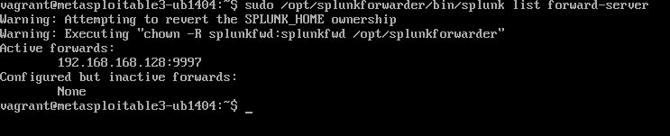

# Splunk Installation Guide

This document explains the installation process of the Splunk Server (SIEM) and Splunk Forwarder used in Phase 2 of the ICS344 project.

---

## 🖥️ Splunk Server (Kali Linux)

###  1. Download Splunk Enterprise `.deb` package:

```bash
wget -O splunk-9.3.2.deb https://download.splunk.com/products/splunk/releases/9.3.2/linux/splunk-9.3.2-d8bb32809498-linux-2.6-amd64.deb
```

###  2. Install the package:

```bash
sudo dpkg -i splunk-9.3.2.deb
sudo apt --fix-broken install
```

###  3. Start Splunk and accept the license:

```bash
sudo /opt/splunk/bin/splunk start --accept-license
```

###  4. Enable auto-start on boot (optional):

```bash
sudo /opt/splunk/bin/splunk enable boot-start
```

---

## 🖥️ Splunk Forwarder (Metasploitable3)

###  1. Download the forwarder `.deb` package:

```bash
wget -O splunkforwarder-9.3.2.deb https://download.splunk.com/products/universalforwarder/releases/9.3.2/linux/splunkforwarder-9.3.2-d8bb32809498-linux-2.6-amd64.deb
```

###  2. Install the package:

```bash
sudo dpkg -i splunkforwarder-9.3.2.deb
sudo apt --fix-broken install
```

###  3. Start the Splunk Forwarder:

```bash
sudo /opt/splunkforwarder/bin/splunk start --accept-license
```

###  4. Connect it to the Splunk Server:

```bash
sudo /opt/splunkforwarder/bin/splunk add forward-server 192.168.168.128:9997
```

###  5. Add logs to monitor:

```bash
sudo /opt/splunkforwarder/bin/splunk add monitor /var/log/syslog
sudo /opt/splunkforwarder/bin/splunk add monitor /var/log/audit/audit.log
```
📘 **Why monitor `/var/log/syslog`?**

`/var/log/syslog` is the main log file in many Debian-based systems (like Metasploitable3) and contains general system activity, including:

- **FTP service logs** (like session opens/closes)  
- **Background cron jobs**  
- **Kernel events**  
- **Network interface updates**  
- **Shell session data** (including commands run via `sudo`, potentially from reverse shells)  

This makes it highly suitable for:  
✔ Monitoring post-exploitation activity  
✔ Tracking attacks at the system level 

📘 **Why also monitor `/var/log/audit/audit.log`?**

`/var/log/audit/audit.log` is the log file used by the Linux Audit system (`auditd`). It provides low-level visibility into **system call activity**, including every time a user or process runs a command.

This is especially useful for detecting **post-exploitation behavior**, such as attacker actions through a **reverse shell**. When properly configured, it allows us to:

- Detect commands like `whoami`, `pwd`, `ifconfig`
- Identify the exact time and command issued
- Tie the activity back to the attacker's shell session

---

## 🛡️ Enabling Command Logging with Auditd

To ensure that every executed command is logged to `/var/log/audit/audit.log`, you need to enable monitoring of the `execve` system call, which is used whenever a new command or process is started.

Run the following commands on **Metasploitable3**:

```bash
sudo auditctl -a exit,always -F arch=b64 -S execve
sudo auditctl -a exit,always -F arch=b32 -S execve
```
These two lines ensure that we can see some of the commands that the attacker runs after exploitation

###  6. Enable auto-start on boot (optional):

```bash
sudo /opt/splunkforwarder/bin/splunk enable boot-start
```

---

## 🧪 Testing the Setup

To verify connectivity between the forwarder and the server:

```bash
sudo /opt/splunkforwarder/bin/splunk list forward-server
```

Expected Output:
