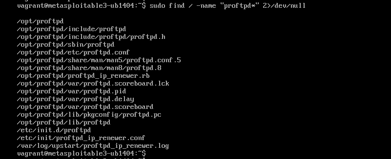
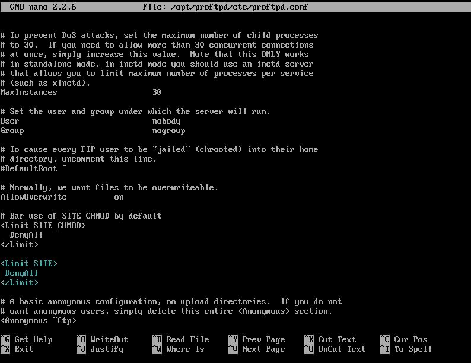
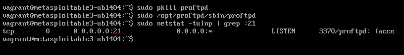
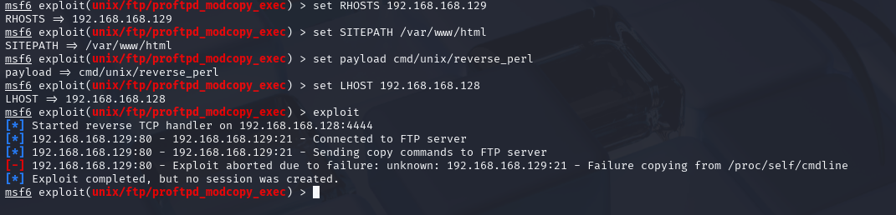

# Phase 3: Defense Implementation and Validation

This phase focuses on **mitigating the ProFTPD `mod_copy` vulnerability** exploited in Phase 1. The goal is to harden the FTP service while keeping it operational, ensuring that **unauthorized file copy commands (SITE CPFR/CPTO)** are blocked.

---

## Step 1: Recap of the Exploited Vulnerability

In **Phase 1**, we exploited **ProFTPD 1.3.5** running on **Metasploitable3** using the **Metasploit module** `exploit/unix/ftp/proftpd_modcopy_exec`. This exploit abused the **mod_copy** module to upload a **Perl reverse shell payload**.

### Attack Process Recap:

1. Connected to **ProFTPD** via **Metasploit**.
2. Launched the **`proftpd_modcopy_exec`** exploit, which:
   - Issued **SITE CPFR/CPTO** commands to **copy a Perl reverse shell** into the web server directory (`/var/www/html/`).
   - Triggered the payload via **HTTP**, causing the victim to open a **reverse shell** back to the attacker.
3. Gained **interactive shell access** on the victim machine.

---

## Step 2: Defense Strategy – Limiting CPFR and CPTO Commands

### 🔹 Locating the ProFTPD Configuration

On **Metasploitable3**, ProFTPD is installed in a **non-standard directory** (`/opt/proftpd/`) instead of the default `/etc/proftpd/`.

We located the configuration file using:

```bash
sudo find / -name "proftpd*" 2>/dev/null
```
This revealed:
`/opt/proftpd/etc/proftpd.conf`

> 📸 *Screenshot of the search:*
>
> 

---

### 🔹 Applied Defense Configuration

To mitigate the vulnerability, we **globally denied SITE CPFR/CPTO commands** in the ProFTPD configuration file (`/opt/proftpd/etc/proftpd.conf`).

The following block was added **outside any `<Anonymous>` tag**:

```apache
<Limit SITE>
  DenyAll
</Limit>
```
> 📸 *Screenshot of configuration:*
>
> 

---

## Step 3: Defense Validation – Retesting the Exploit

### 🔹 Restarting ProFTPD

We restarted ProFTPD manually to apply the configuration changes:

```bash
sudo pkill proftp
sudo /opt/proftpd/sbin/proftpd
```
> 📸 *Screenshot proof of restart:*
>
> 

---

### 🔹 Running the Metasploit Exploit Again

We re-launched the same **Metasploit exploit** (`proftpd_modcopy_exec`) with identical settings:

- **RHOSTS:** Victim IP (`192.168.168.129`)
- **LHOST:** Attacker IP (`192.168.168.128`)

---

### 🔹 Validation Outcome:

- The **exploit failed** to upload the reverse shell payload via FTP.
- **No FTP session logs** showed **SITE CPFR/CPTO** command usage.
- The **attack vector was successfully mitigated**.

---

## Step 4: Screenshot Proof

### 🔍 Metasploit Exploit Attempt (After Defense):

> 📸 *Screenshot showing exploit failure:*
>
> 

This screenshot confirms:

- The **exploit could not copy** the payload via **mod_copy**.
- The attacker failed to **establish a reverse shell**.

---

## Conclusion

By **restricting SITE CPFR/CPTO commands** in the **ProFTPD configuration**, we successfully mitigated the vulnerability exploited in Phase 1.

- **ProFTPD remained operational** for legitimate FTP use.
- The **Metasploit exploit** was blocked.
- The **attack surface** was reduced without disabling the FTP service.

This concludes the **defense implementation and validation** for Phase 3.
